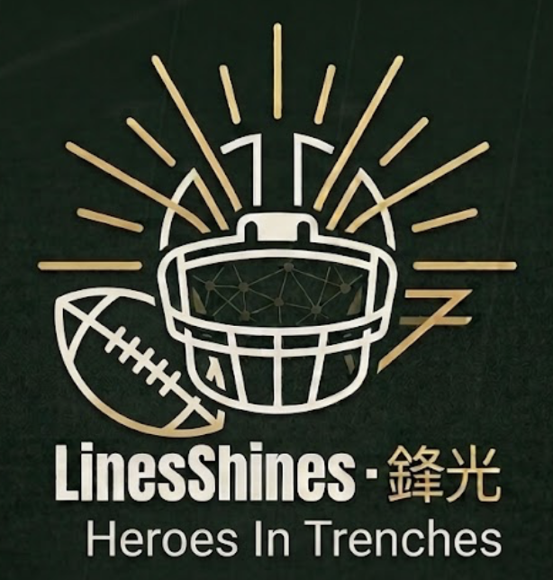

  

# 🏈LinesShines · 鋒光

---

### [🔷 Blue 80 Blue 80 🏟](https://lines-shines.up.railway.app)

### [📗 Background Stories ➡️️](https://starsexpress.github.io/Faraway-s-Way/linesshines/)

---

### 🏅 Heroes In Trenches
#### ① Backend

- Python + PostgreSQL — ingest processed data into database.
- Python + FastAPI — API endpoints for database query, plotly designs, PNG download, and output to frontend.

#### ② Frontend

- JavaScript + CSS + HTML — visualize plotly graphs and interactive components.

#### ③ CI/CD

- Pytest — unit & API tests.
- GitHub — CI/CD pipeline triggers.
- Railway — platform deployment.
